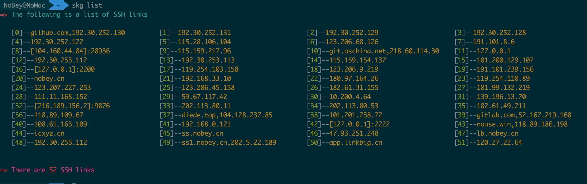
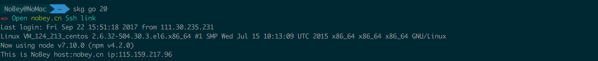
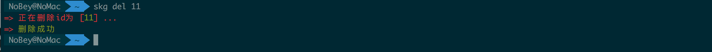
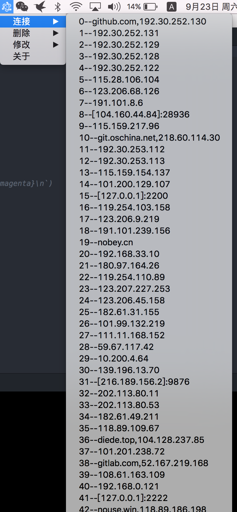

# ssh-key-god

> 管理本机ssh链接

---

#### 安装

> npm i ssh-key-god -g

#### 查看连接过的ssh
>  skg list

#### 直接连接 ssh
> skg go id   - [id] 是 list 后给出的id

#### 删除ssh连接  
> skg del id  - [id] 是 list 后给出的id

### 关于桌面版

> 后面研究好会发出刚方便的版本

